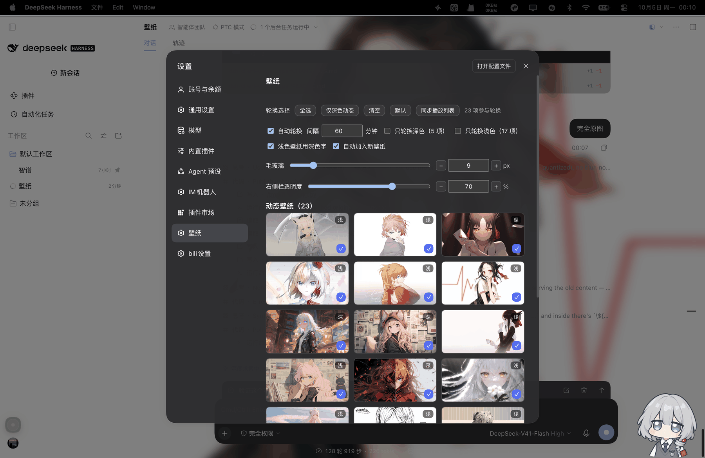

# dsh-client-ui-wallpaper

[](https://github.com/gnk478/dsh-client-ui-wallpaper/actions/workflows/check.yml)
[](https://www.npmjs.com/package/dsh-client-ui-wallpaper)

把本地图片 / 视频（例如 [Dynamic Wallpaper.app](https://apps.apple.com/app/id1505218567) 播放列表里的素材）
用作 **DSH 桌面客户端**的背景：整窗铺满、背景模糊、面板与左右侧栏透明度分别可控，字色跟着壁纸明暗自动切换。

> 这是 `~/.dsh/profiles/desktop/plugins/dsh-client-ui-wallpaper` 的完整项目版：含挂载声明、安装脚本、自检脚本与文档；已发布到 npm（[dsh-client-ui-wallpaper](https://www.npmjs.com/package/dsh-client-ui-wallpaper)）。



> 上图为**真实运行截图**（macOS 客户端，设置 → 壁纸）：轮换选择与「23 项参与轮换」、自动轮换间隔 60 分钟、只轮换深色 5 项 / 浅色 17 项、浅色壁纸用深色字、自动加入新壁纸、毛玻璃 9px、右侧栏透明度 70%，下方是动态壁纸缩略图网格（每格右上角标注该壁纸的明暗判定）。截图为整幅实拍原图（未裁切、未遮挡、未修饰），仅等比缩放到 1800px 宽。

## 功能

**背景**

- 图片或视频铺满整窗（`object-fit: cover`），面板半透明让壁纸透出来；弹窗保持不透明
- 背景模糊可调（0–60px）；可选纱层（浅色外观白纱 / 深色外观黑纱）
- 静态与动态分开：图片可配「同名视频」，网格里用 **▶ 动态** 一键切换
- 轮换：间隔 15 秒–24 小时可调；支持「全选 / 仅深色动态 / 清空 / 默认」

**可读性（墨水）**

- 按壁纸亮度自动切深/浅字（含代码块、行内 code、气泡、工具栏、输入框与 caret）
- **代码块只跟外观走**：浅色外观浅底深字、深色外观深底浅字（绕开 `pre.shiki` 透明背景导致的误判）
- 设置弹窗内的字色复位为「该外观本来的值」，不被壁纸影响

**面板与控件**（设置 → 壁纸）

| 控件 | 说明 |
|---|---|
| 壁纸网格 | 静态/动态分组，缩略图 + 深/浅角标 + `✓/+` 轮换勾选 + 当前/播放中标记 |
| 背景模糊 | 滑块 + `− [数字框] +` 精确步进（0–60，居中、无原生箭头） |
| 右侧栏透明度 | 0–100% 线性，独立于面板；左栏保持原透明观感 |
| 只轮换深色 / 只轮换浅色 | 优先用缩略图实测亮度判定，未采样时按配置名单取反 |
| 自动加入新壁纸 | 新丢进目录的素材自动入库并追加进轮换 |
| 自动轮换 / 间隔 | 秒数可调；可勾「随机轮换」（不会连续两次同一张） |
| 视频省电暂停 | 窗口不可见时暂停播放，回到前台自动续播（隐藏期间不切新壁纸） |
| 浅色壁纸用深色字 | 关掉就固定用浅色字 |
| 同步播放列表 | 一键把 Dynamic Wallpaper.app 播放列表里的素材同步进来 |
| 删除（缩略图悬停） | 移到「废纸篓」（可恢复）+ 删缩略图缓存 + 从轮换移除 + 记入同步跳过名单 |
| 侧栏小圆钉 | 与头像中心对齐的收起按钮，点空白处自动收回 |

## 安装

三种方式任选一种；装完刷新页面（或重启 DSH），打开 **设置 → 壁纸**：

**A. 从 npm 装**（[dsh-client-ui-wallpaper](https://www.npmjs.com/package/dsh-client-ui-wallpaper)）

```bash
npm i dsh-client-ui-wallpaper
# 装进某个 profile（默认 desktop）；会先备份该 profile 的 cordis.patch.yml
node node_modules/dsh-client-ui-wallpaper/scripts/install.mjs --profile desktop
```

**B. 从源码装**

```bash
git clone https://github.com/gnk478/dsh-client-ui-wallpaper.git
cd dsh-client-ui-wallpaper
node scripts/install.mjs --profile desktop
```

**C. 用 DSH 插件管理器**（把 clone / 解压好的目录挂进去）

```bash
dsh plugin --profile desktop add link:/绝对路径/dsh-client-ui-wallpaper
```

## 快速开始

素材二选一：

- **什么都不用做**：默认直接读 [Dynamic Wallpaper.app](https://apps.apple.com/app/id1505218567) 的素材库
  `~/Library/Containers/whbalzac.Dongtaizhuomian/Data/Documents/{Wallpaper,Videos}`
- **用自己的目录**：在 config 里写**绝对路径**（插件不做 `~` 展开），例如
  `imageDir: /Users/you/.dsh/wallpapers`、`videoDir: /Users/you/.dsh/videos`

```bash
mkdir -p ~/.dsh/wallpapers ~/.dsh/videos
cp ~/Pictures/some.jpg ~/.dsh/wallpapers/          # 静态壁纸
cp ~/Movies/some.mp4  ~/.dsh/videos/               # 动态壁纸

node scripts/check.mjs                             # 自检
```

## 配置

### config（`cordis.patch.yml` 的 `ui-wallpaper` 行，见 [examples/profile-cordis.patch.yml](examples/profile-cordis.patch.yml)）

| 键 | 默认 | 说明 |
|---|---|---|
| `imageDir` / `videoDir` | Dynamic Wallpaper.app 素材库的 `Wallpaper/` 与 `Videos/`（`lib/index.js:37-39`） | 素材目录，**必须是绝对路径**（插件不做 `~` 展开） |
| `mode` | `image` | `image` / `video` / `rotate` |
| `image` / `video` | `''` | 固定的文件名 |
| `live` | `false` | 图片有同名视频时用视频做动态壁纸 |
| `rotateSeconds` | `300` | 轮换间隔（秒） |
| `shuffle` | `false` | 随机轮换（不会连续两次同一张） |
| `blur` | `8` | 背景模糊（px） |
| `panelOpacity` | `0` | 面板不透明度（0 = 全透） |
| `windowOpacity` | `0.96` | 弹窗不透明度 |
| `dim` | `0` | 纱层强度 |
| `autoInk` | `true` | 按壁纸亮度自动切字色 |
| `autoInclude` | `true` | 新素材自动加入轮换 |
| `only` / `darkVideos` | `[]` | 深色壁纸 / 深色动态白名单 |

### state（`~/.dsh/wallpaper-state.json`，面板里改的都落这里）

`mode`、`image`、`video`、`live`、`rotation`、`only`、`videoPool`、`blur`、`panelOpacity`、`sidebarOpacity`（`null` = 跟随面板）、`autoInk`、`autoInclude`、`knownFiles`、`lastAdded`、`rotateSeconds`、`shuffle`

```bash
# 直接读/写状态（调试用）
curl -s  http://127.0.0.1:19387/wallpaper/state
curl -s -X POST -H 'content-type: application/json' \
     -d '{"sidebarOpacity":0.35}' http://127.0.0.1:19387/wallpaper/state
```

## 与 Dynamic Wallpaper.app 同步

app 的播放列表在：

```
~/Library/Containers/whbalzac.Dongtaizhuomian/Data/Documents/
  ├── Videos/                播放列表素材
  ├── Wallpaper/             静态壁纸
  └── Setting/Preferences.json   playlist_array（播放列表）
```

两种同步方式（都**只增不删**；读取该目录需要给 DSH「完全磁盘访问权限」）：

```bash
# 面板：设置 → 壁纸 → 同步播放列表
# 或命令行
./sync-wallpaper-playlist.sh            # 只同步播放列表里的视频
./sync-wallpaper-playlist.sh --stills   # 连静态壁纸目录一起
```

同步会跳过 `~/.dsh/wallpaper-sync-skip.txt` 里列出的文件名（删除过的素材会自动写进去，防止被拉回）。

## 目录结构

```
dsh-client-ui-wallpaper/
├── lib/
│   ├── index.js                 宿主：路由 / 扫描 / 状态 / 抽帧 / 同步 / 删除
│   └── client.js                客户端：注入样式 / 铺背景 / 面板 UI / 墨水判定
├── scripts/
│   ├── install.mjs              安装进 profile（备份 + 复制 + 写 insert 行）
│   └── check.mjs                静态自检（语法 + 路由 + 样式常量 + 控件）
├── docs/ARCHITECTURE.md         架构、路由表、样式常量、踩坑记录
├── .github/workflows/           check.yml（自检）+ publish.yml（npm 可信发布）
├── examples/profile-cordis.patch.yml  带完整配置的挂载示例
├── examples/github-workflow-publish.yml  publish.yml 副本（方便复制）
├── cordis.patch.yml             本插件的挂载声明
├── CHANGELOG.md / PROVENANCE.md / LICENSE
└── README.md
```

## 开发

- 宿主是普通 cordis 插件，改完由 DSH 的 HMR 重载；客户端 `lib/client.js` 改动会被热替换（注意：**热替换会重置模块级变量**，需要跨次保留的数据要放 `window` / sessionStorage）
- 自检：

  ```bash
  node scripts/check.mjs
  node --test                                          # 行为测试（mock ctx：路由 / 回收站 / 缩略图 GC / 随机轮换）
  curl -s http://127.0.0.1:19387/wallpaper/_client | python3 -m json.tool | head -40   # 客户端自报状态
  curl -s http://127.0.0.1:19387/wallpaper/_hits                                        # 各路由请求计数
  ```

## 发布与打包

**npm 发布走可信发布（Trusted Publishing / OIDC），不需要 token**：

1. 改 `package.json` 的 `version`、更新 `CHANGELOG.md`
2. 在 npm 包设置里配 Trusted Publisher：GitHub Actions → Organization `gnk478`、Repository `dsh-client-ui-wallpaper`、Workflow `publish.yml`，Allowed actions 勾上 `npm publish`
3. 推 tag 或手动触发 [`.github/workflows/publish.yml`](.github/workflows/publish.yml)：

```bash
git tag v1.0.1 && git push origin v1.0.1   # tag 触发
gh workflow run publish.yml                 # 或手动触发
```

工作流里 `permissions: id-token: write` 是关键（OIDC 身份）；`npm publish` 会自动带 provenance。
本地手工发布仍然可用，但需要一个开了 **Bypass 2FA** 的 Granular Access Token：`npm login && npm publish`（`prepublishOnly` 会先跑 `scripts/check.mjs` 与 `node --test`）。

**Release 附件**：

```bash
git archive --format=zip -o dsh-client-ui-wallpaper-1.0.1.zip HEAD
gh release create v1.0.1 dsh-client-ui-wallpaper-1.0.1.zip
```

**CI**：[`.github/workflows/check.yml`](.github/workflows/check.yml) 在 push / PR 时跑 `node scripts/check.mjs` 与 `node --test`，也是顶部徽章的来源；两个工作流的副本放在 `examples/` 下方便复制。

## 故障排查

| 症状 | 原因 / 处理 |
|---|---|
| 壁纸没铺满 | 面板里确认已选壁纸；检查 `/wallpaper/list.json` 是否有素材 |
| 侧栏/右栏透明度拖了没反应 | 常见于「透明化扫描」清掉了底色；本版本已对右栏跳过扫描并直接写 `background-color`。若自行改过选择器，核对 `SIDEBAR_CSS` / `SIDEBAR_LEFT_CSS` |
| 代码块字看不清 | 代码块应「只跟外观走」；检查 `CODEFIX_CSS` 是否注入 |
| 视频缩略图一直是灰的 | 首次访问 `/wallpaper/thumb/<name>` 会调 `qlmanage` 抽帧，稍等再刷新；检查 `~/.dsh/wallpaper-thumbs/` |
| 新素材不出现 | 刷新面板（宿主目录扫描有 4 秒快照缓存，见 `lib/index.js:229`）；确认扩展名在白名单（图片 jpg/jpeg/png/webp/gif/avif/bmp，视频 mp4/webm/mov/m4v） |
| 改了 profile 文件不生效 | DSH 运行中会用内存配置回写 profile 文件；完全退出后再改，或改用「设置」界面 |
| 面板打不开 / 报错 | 看 `/wallpaper/_client` 的 `lastError`，以及宿主日志 |

## 已知限制

- 与 DSH 的布局类名（`_6Qf49G_*`）和色板 token（`--dsw-*`）耦合，DSH 升级后可能需要同步调整
- 播放列表同步依赖 macOS 的 TCC 权限（完全磁盘访问）与 `qlmanage`（缩略图抽帧）
- 删除会移到 `~/.Trash`（可恢复）；素材与废纸篓不在同一卷时 `rename` 失败，会回退为真删，面板提示「已永久删除」

## License

[MIT](LICENSE)